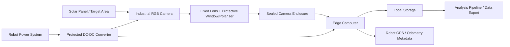

# Camera System Hardware Pathway

## 1. Purpose

The main idea is to have the whole system work well in pretty serious weather conditions like high heat (100+F), dust, etc. 

We will be splititng the full inference into partly on the edge computer and partly on the cloud
  

---

## 2. Proposed Hardware Components

The proposed camera system would be made of the following main hardware components:

- **Industrial RGB Camera**
  - Captures visible images of the solar panels.
  - Should be rugged enough for outdoor use.
  - Preferably should use a global shutter to reduce motion distortion while the robot is moving.

- **Fixed Lens**
  - Controls the field of view and image sharpness.
  - A fixed lens is preferred over autofocus because it is more reliable in vibration, glare, and dust.
  - The lens should be chosen based on the final camera mounting distance from the panel.

- **Protective Lens Window**
  - Protects the camera lens from dust, water splashes, and debris.
  - Should be easy to clean or replace if it gets scratched or dirty.

- **Polarizing Filter**
  - Helps reduce glare from the glass surface of the solar panels.
  - Should be tested because it may reduce brightness and require exposure adjustments.

- **Sealed Protective Enclosure**
  - Protects the camera from dust, heat, vibration, and water splashes.
  - Should have an appropriate IP rating, likely IP65 or higher depending on splash exposure.
  - Should allow the camera to be securely mounted and still have a clear view of the panel.

- **Edge Computer**
  - Controls the camera and handles image capture.
  - Adds metadata such as timestamp, robot ID, mission ID, GPS coordinates, row, and panel number.
  - Stores images locally and prepares them for the analysis pipeline.

- **Local SSD Storage**
  - Stores images during the mission.
  - Prevents data loss if the robot does not have a stable internet connection.
  - Should have enough capacity for at least one full mission.

- **Robot GPS/Odometry Connection**
  - Provides location and movement information for each image.
  - Allows every image to be georeferenced.
  - Helps connect each image to the correct row, panel, and mission.

- **Protected DC-DC Converter**
  - Converts robot power into the voltage needed by the camera and edge computer.
  - Protects the system from power instability.
  - Should include proper fusing or electrical protection.

- **Rugged Cables and Connectors**
  - Connect the camera, edge computer, power system, and robot data interfaces.
  - Should be vibration-resistant and protected from water, dust, and moving parts.
  - Locking connectors are preferred so cables do not disconnect during robot movement.

- **Mechanical Mounting Bracket**
  - Holds the camera in the correct position and angle.
  - Should be rigid enough to reduce vibration.
  - Should allow adjustment during testing before the final mounting angle is chosen.

- **Cable Routing and Protection**
  - Keeps wires away from the brush, wheels, moving parts, and sharp edges.
  - Prevents cable damage during field operation.
  - Should be planned as part of the final installation design.

---
## 3. Main Hardware Pathway

The proposed hardware pathway is:

---

## 4. Proposed Items

- **Camera: *LUCID Triton TRI050S-CC***
  - Primary camera option for this system.
  - Justification written in `CameraChoice.md`.
  - Key reasons for selection:
    - 5.0 MP resolution
    - Global shutter
    - GigE / PoE interface
    - C-mount lens compatibility
    - IP67 capability with proper lens tube and cables
    - Good fit for outdoor robotic image capture
- **Edge Computer: *RUBIK Pi 3***
  - Primary edge computer option for this system.
  - Justification written in `EdgeComputerChoice.md`.
  - Key reasons for selection:
    - Enough compute for image capture, metadata tagging, and light preprocessing
    - Supports split inference between edge and cloud
    - Gigabit Ethernet for connecting to the industrial camera system
    - USB 3.0 support for peripherals
    - M.2 support for local SSD storage
    - Lower power and complexity compared with a heavier edge AI computer
    - Better fit for the first prototype than the Jetson Orin Nano if full onboard inference is not required