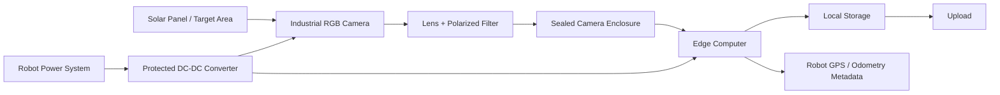
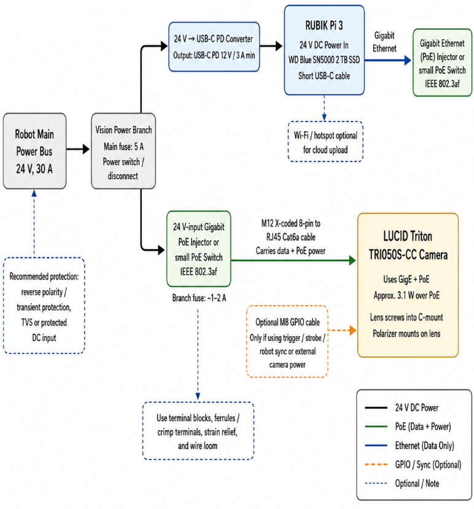

# Camera System Hardware Pathway

## 1. Purpose

The main idea is to have the whole system work well in pretty serious weather conditions like high heat (100+F), dust, etc. 

We will be splititng the full inference into partly on the edge computer and partly on the cloud
  

---

## 2. Proposed Hardware Components

The proposed camera system would be made of the following main hardware components:

- **Industrial RGB Camera**
  - Captures visible images of the solar panels.
  - Should be rugged enough for outdoor use.
  - Preferably should use a global shutter to reduce motion distortion while the robot is moving.

- **Fixed Lens**
  - Controls the field of view and image sharpness.
  - A fixed lens is preferred over autofocus because it is more reliable in vibration, glare, and dust.
  - The lens should be chosen based on the final camera mounting distance from the panel.

- **Polarizing Filter**
  - Helps reduce glare from the glass surface of the solar panels.
  - Should be tested because it may reduce brightness and require exposure adjustments.

- **Sealed Protective Enclosure**
  - Protects the camera from dust, heat, vibration, and water splashes.
  - Should have an appropriate IP rating, likely IP65 or higher depending on splash exposure.
  - Should allow the camera to be securely mounted and still have a clear view of the panel.

- **Edge Computer**
  - Controls the camera and handles image capture.
  - Adds metadata such as timestamp, robot ID, mission ID, GPS coordinates, row, and panel number.
  - Stores images locally and prepares them for the analysis pipeline.

- **Local SSD Storage**
  - Stores images during the mission.
  - Prevents data loss if the robot does not have a stable internet connection.
  - Should have enough capacity for at least one full mission.

- **Robot GPS/Odometry Connection**
  - Provides location and movement information for each image.
  - Allows every image to be georeferenced.
  - Helps connect each image to the correct row, panel, and mission.

- **DC-DC Converter**
  - Converts robot power into the voltage needed by the camera and edge computer.
  - Protects the system from power instability.
  - Should include proper fusing or electrical protection.

- **Rugged Cables and Connectors**
  - Connect the camera, edge computer, power system, and robot data interfaces.
  - Should be vibration-resistant and protected from water, dust, and moving parts.
  - Locking connectors are preferred so cables do not disconnect during robot movement.

- **Mechanical Mounting Bracket**
  - Holds the camera in the correct position and angle.
  - Should be rigid enough to reduce vibration.
  - Should allow adjustment during testing before the final mounting angle is chosen.

- **Cable Routing and Protection**
  - Keeps wires away from the brush, wheels, moving parts, and sharp edges.
  - Prevents cable damage during field operation.
  - Should be planned as part of the final installation design.

---
## 3. Main Hardware Pathway

The proposed hardware pathway is:

---

## 4. Proposed Items

- **Camera: *LUCID Triton TRI050S-CC***
  - Justification written in `CameraChoice.md`.

- **Edge Computer: *RUBIK Pi 3***
  - Justification written in `EdgeComputerChoice.md`.

- **Local Storage: *WD Blue SN5000 2TB NVMe M.2 2280 SSD***
  - Fits the RUBIK Pi 3 system because it uses the required **M.2 2280 NVMe** 
  - The **2TB capacity** gives the system plenty of room for for lots of storage incase theres no wifi or ocnnection possible.
  - will integrate into the system very easily. 

- **Lens: *LUCID / Universe UC080-5M / BL080C 8mm C-Mount 5MP 2/3" Lens* - ~$420-560**
  - Compatible with the LUCID Triton TRI050S-CC because it uses a C-mount and supports up to 2/3" sensors.
  - Rated for 5MP imaging, matching the 5MP resolution of the selected Triton camera.
  - The robot is only about 298mm tall, so a 8mm lens inspects a good strip of the panel at once.
  - Manual focus and manual iris are suitable for a fixed mount, so camera-to-panel distance will stay consistent.
  - C-mount matches the LUCID camera.

- **Optical Filter: *Edmund Optics M22.5 × 0.50 Machine Vision Mounted Linear Glass Polarizing Filter***
  - Recommended because the target surface is **solar panels in direct sunlight**, which can create strong glare and reflections from the glass surface.
  - Helps reduce specular glare and bright hot spots, allowing the camera to capture the actual solar panel surface more clearly.
  - Fits the camera lens, which uses an **M22.5 × 0.5mm** filter thread.
  - The rotating mount allows the filter angle to be adjusted during setup for maximum glare reduction.
  - The locking thumbscrew helps keep the polarizer orientation fixed after adjustment, which is useful for a mounted field system.
  - Improves image consistency and contrast, which helps the computer vision system avoid being confused by sunlight reflections.

- **Power Converter: *Coolgear ChargeIt! Mini 100W USB-C PD 3.0 Surface Mount Charger***
  - Converts the robot’s 24 V power into USB-C Power Delivery for the RUBIK Pi 3.
  - Supports the needed 12 V / 3 A USB-C PD output profile.
  - Better than a normal USB charger because the RUBIK Pi 3 needs proper USB-C PD negotiation.
  - Has a mountable enclosure, which makes it easier to secure inside the robot.
  - Connects to the robot through a 2-pin DC input terminal, then powers the RUBIK Pi 3 through USB-C.

- **PoE Network Switch: *LINOVISION Industrial Full Gigabit PoE Switch, 12/24 V Input Version***
  - Powers the LUCID Triton camera through PoE.
  - Passes image data from the camera back to the RUBIK Pi 3 over Ethernet.
  - Accepts low-voltage DC input, so it can run from the robot’s 24 V power system.
  - Supports gigabit Ethernet, which is important for the LUCID GigE camera.
  - Easier to expand than a single PoE injector because more Ethernet devices can be added later.

- **Camera Ethernet Cable: *LUCID M12 X-coded 8-pin to RJ45 Cat6a Cable***
  - Connects the LUCID Triton camera to the PoE switch.
  - M12 X-coded side connects to the camera.
  - RJ45 side connects to a PoE port on the switch.
  - Carries both camera power and image data through one cable.
  - Cat6a rating gives enough bandwidth margin for gigabit Ethernet.

- **RUBIK Pi Ethernet Cable: *Short Shielded Cat6a RJ45 Patch Cable***
  - Connects the RUBIK Pi 3 Ethernet port to the PoE switch LAN/uplink port.
  - Carries image data from the camera network to the RUBIK Pi 3.
  - Shielded Cat6a is preferred because the robot may have electrical noise from motors and power wiring.
  - Short cable length keeps the electronics box cleaner and easier to manage.

- *Optional:* **Fused Distribution Block: *Blue Sea Systems 5025 ST Blade Fuse Block, 6 Circuits with Negative Bus and Cover***
  - Splits the robot’s 24 V vision power branch into multiple protected outputs.
  - Allows separate fuses for the RUBIK Pi power branch and the PoE switch branch.
  - Cleaner and safer than twisting wires together or making loose splices.
  - Includes a negative bus, which helps organize both 24 V positive and ground wiring.
  - The covered design is safer inside a robot electronics enclosure.

- **Fuses: *Littelfuse ATO / ATOF Blade Fuses***
  - Protects the vision system wiring and electronics from overcurrent.
  - Use around 5A for the main bus.
  - Use around 3A for the RUBIK Pi power-converter branch.
  - Use around 1–2A for the PoE switch/camera branch.
  - Standard blade fuses are easy to replace and easy to find.

- *Optional: * **Power Switch: *Carling Technologies L-Series Sealed Rocker Switch***
  - Provides a dedicated on/off switch for the whole vision system.
  - Lets the camera, PoE switch, and RUBIK Pi power system be shut off without turning off the entire robot.
  - Sealed design is better for a robot environment than an open, exposed switch.
  - Current rating is much higher than the expected current draw of the vision branch.
  - Useful as a service disconnect during testing and maintenance.

- **Robot Power Connector: *TE Connectivity / DEUTSCH DT 2-Pin Connector Set***
  - Provides a rugged locking connector between the robot and the vision module.
  - Carries 24 V positive and ground from the robot into the vision power system.
  - Locking design prevents the connector from shaking loose during robot movement.
  - Weather-sealed design is better for outdoor or dusty robot environments.
  - Makes the vision module removable without cutting or rewiring cables.

- **Main Power Wire: *18 AWG Stranded Red/Black Wire***
  - Used for the main 24 V power run from the robot to the vision power system.
  - Stranded wire is better than solid wire for vibration and movement.
  - 18 AWG gives good current margin for the fused vision branch.
  - Red and black wiring keeps positive and ground easy to identify.

- **Branch Power Wire: *20–22 AWG Stranded Red/Black Wire***
  - Used for short low-current internal power branches.
  - Good for wiring from the distribution block to the USB-C PD converter and PoE switch.
  - Easier to route inside the enclosure than thicker wire.
  - Still sufficient for the low current draw of the camera and RUBIK Pi power branches.

- **Wiring Hardware: *Ferrules, Crimp Terminals, Heat Shrink, Labels, Strain Relief, and Wire Loom***
  - Ferrules and crimp terminals make cleaner and more reliable electrical connections.
  - Heat shrink protects exposed metal and strengthens wire ends.
  - Labels make debugging and maintenance much easier.
  - Strain relief prevents connectors and terminals from taking direct cable-pull force.
  - Wire loom protects the wiring from rubbing, vibration, and robot movement.

- **Location Tracking / Image Geotagging: *NaviSys GR-U01U USB GNSS Receiver***
  - Adds location metadata to each captured image, allowing the final report to show where each detected panel issue or anomaly was found.
  - Plugs into the RUBIK Pi 3 over USB, making it much easier to integrate than a bare GNSS module that would require UART wiring or custom electronics.
  - Does not require a hotspot, RTK base station, or correction service for the basic GNSS version.
  - Includes the GNSS receiver and antenna in one packaged unit, so a separate external antenna is not needed.
  - Can be mounted on the top of the robot or enclosure to maintain clear sky visibility for better satellite reception.
  - Helps connect camera data with physical robot location, which makes the inspection system more useful for solar farm reporting and maintenance.

  ## 5. Architectcure w/materials

  