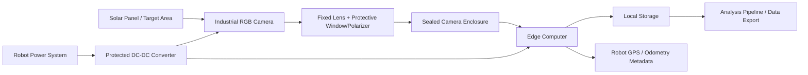

# Camera System Hardware Pathway

## 1. Purpose

The main idea is to have the whole system work well in pretty serious weather conditions like high heat (100+F), dust, etc. 

We will be splititng the full inference into partly on the edge computer and partly on the cloud
  

---

## 2. Proposed Hardware Components

The proposed camera system would be made of the following main hardware components:

- **Industrial RGB Camera**
  - Captures visible images of the solar panels.
  - Should be rugged enough for outdoor use.
  - Preferably should use a global shutter to reduce motion distortion while the robot is moving.

- **Fixed Lens**
  - Controls the field of view and image sharpness.
  - A fixed lens is preferred over autofocus because it is more reliable in vibration, glare, and dust.
  - The lens should be chosen based on the final camera mounting distance from the panel.

- **Protective Lens Window**
  - Protects the camera lens from dust, water splashes, and debris.
  - Should be easy to clean or replace if it gets scratched or dirty.

- **Polarizing Filter**
  - Helps reduce glare from the glass surface of the solar panels.
  - Should be tested because it may reduce brightness and require exposure adjustments.

- **Sealed Protective Enclosure**
  - Protects the camera from dust, heat, vibration, and water splashes.
  - Should have an appropriate IP rating, likely IP65 or higher depending on splash exposure.
  - Should allow the camera to be securely mounted and still have a clear view of the panel.

- **Edge Computer**
  - Controls the camera and handles image capture.
  - Adds metadata such as timestamp, robot ID, mission ID, GPS coordinates, row, and panel number.
  - Stores images locally and prepares them for the analysis pipeline.

- **Local SSD Storage**
  - Stores images during the mission.
  - Prevents data loss if the robot does not have a stable internet connection.
  - Should have enough capacity for at least one full mission.

- **Robot GPS/Odometry Connection**
  - Provides location and movement information for each image.
  - Allows every image to be georeferenced.
  - Helps connect each image to the correct row, panel, and mission.

- **Protected DC-DC Converter**
  - Converts robot power into the voltage needed by the camera and edge computer.
  - Protects the system from power instability.
  - Should include proper fusing or electrical protection.

- **Rugged Cables and Connectors**
  - Connect the camera, edge computer, power system, and robot data interfaces.
  - Should be vibration-resistant and protected from water, dust, and moving parts.
  - Locking connectors are preferred so cables do not disconnect during robot movement.

- **Mechanical Mounting Bracket**
  - Holds the camera in the correct position and angle.
  - Should be rigid enough to reduce vibration.
  - Should allow adjustment during testing before the final mounting angle is chosen.

- **Cable Routing and Protection**
  - Keeps wires away from the brush, wheels, moving parts, and sharp edges.
  - Prevents cable damage during field operation.
  - Should be planned as part of the final installation design.

---
## 3. Main Hardware Pathway

The proposed hardware pathway is:

---

## 4. Camera Comparison Matrix

> Note: Field of view is lens-dependent for these industrial cameras. The camera body determines the sensor, shutter type, interface, and ruggedness, while the selected lens determines the actual field of view.

### Table 1: Core Camera Specifications

| # | Camera | Resolution | Shutter Type | Field of View | Interface | Lens Mount | Operating Temperature |
|---:|---|---|---|---|---|---|---|
| 1 | **LUCID Triton TRI050S-CC** | 2448 × 2048, 5.0 MP | Global shutter | Lens-dependent. Uses C-mount lenses, so FOV changes based on focal length. | GigE / PoE | C-mount | -20°C to +55°C |
| 2 | **Teledyne FLIR Blackfly S BFS-PGE-50S5C-C** | 2448 × 2048, 5.0 MP | Global shutter | Lens-dependent. Uses C-mount lenses. | GigE / PoE | C-mount | 0°C to +50°C |
| 3 | **Basler ace 2 Pro a2A2448-23gcPRO** | 2448 × 2048 default, 5.0 MP | Global shutter | Lens-dependent. Uses C-mount lenses. | GigE / PoE or 12–24 VDC | C-mount | -10°C to +50°C |
| 4 | **Allied Vision Alvium 1800 U-507c** | 2464 × 2056, 5.1 MP | Global shutter | Lens-dependent. Uses C-mount lenses. | USB 3.0 | C-mount | +5°C to +65°C housing temperature |
| 5 | **IDS uEye+ FA GV-5040FA-C-HQ** | 1456 × 1088, 1.58 MP | Global shutter | Lens-dependent. Uses C-mount lenses. | GigE / PoE | C-mount | 0°C to +55°C |

  ### Table 2: Ruggedness, Power, Cost, and Integration

| # | Camera | IP Rating | Dust / Water / Vibration Suitability | Trigger / Sync Support | Technical Specs | Approx. Cost | Enclosure Needed? | Integration Risk | Why It Is a Good Option |
|---:|---|---|---|---|---|---:|---|---|---|
| 1 | **LUCID Triton TRI050S-CC** | IP67 when used with proper IP67 lens tube and cables | Strong option for dust and splash protection. Good fit for field robotics if sealed correctly. | Hardware trigger, software trigger, and PTP / IEEE 1588 support | 67 g; 29 × 29 × 45 mm; 12–24 VDC or PoE; about 2.5 W external / 3.1 W PoE | ~$550 | Partial. It can be IP67 with correct accessories, but still needs a secure robot mount and cable protection. | Low to medium | Best overall balance of ruggedness, global shutter, PoE, compact size, and cost. |
| 2 | **Teledyne FLIR Blackfly S BFS-PGE-50S5C-C** | Not IP-rated by default | Good industrial camera, but not sealed for outdoor dust or water exposure by itself. | Hardware trigger or software trigger | 36 g; 29 × 29 × 30 mm; about 3 W; compact industrial body | ~$880 | Yes. Needs a sealed protective enclosure for field use. | Medium | Strong image quality, good SDK support, and reliable machine-vision performance. |
| 3 | **Basler ace 2 Pro a2A2448-23gcPRO** | IP30 | Not suitable for direct dust or water exposure. Needs external enclosure and strong mounting. | Hardware trigger, software trigger, or free run | 100 g; 55.5 × 29 × 29 mm; PoE or 12–24 VDC; about 2.9 W GPIO / 4.2 W PoE | ~$829–$1,155 | Yes. Needs a sealed enclosure for outdoor robot use. | Medium | Reliable industrial camera ecosystem with strong documentation and vendor support. |
| 4 | **Allied Vision Alvium 1800 U-507c** | Not IP-rated by default | Good compact embedded camera, but needs protection from dust, water, and brush-area debris. | Hardware trigger through GPIO or software trigger | Around 60–65 g; 38 × 29 × 29 mm; USB power or external 5 V; about 2.0 W | ~$945 | Yes. Needs a sealed enclosure for field use. | Medium to high | Good embedded/robotics option, especially if the edge computer is USB-based. |
| 5 | **IDS uEye+ FA GV-5040FA-C-HQ** | IP65 / IP67 style rugged housing; IDS also lists strong IP protection for the FA family | Best rugged physical option for dust and water. Designed for harsh industrial environments. | Hardware trigger or software trigger | 173 g; 41 × 53 × 42.7 mm; PoE or 12–24 VDC; about 1.4–3.1 W | ~$775 | Usually no full enclosure needed if paired with compatible IP-rated lens/accessories, but still needs a protective robot mount. | Low for environment, medium for resolution | Very rugged, but lower resolution may be a limitation for detailed panel analysis. |